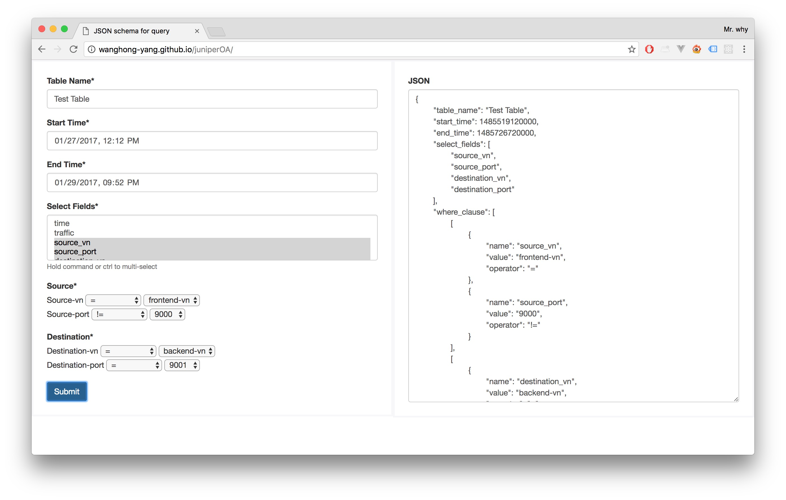

# Juniper OA Answer

##Problem Statement:
Given a JSON schema for a query, design and implement a UI to display a form that can be used to create this query. On submit of this form show the final Query JSON on the HTML page below the form.

The form should display the help for the fields as per the description provided in the JSON schema.

Write unit tests to test the validation of the above form.

##Online Demo:
Webpage: [http://wanghong-yang.github.io/juniperOA/](http://wanghong-yang.github.io/juniperOA/)

Code: [https://github.com/WangHong-yang/wanghong-yang.github.io/tree/master/juniperOA](https://github.com/WangHong-yang/wanghong-yang.github.io/tree/master/juniperOA)

##File Structure:
- index.html
- style
    - style.css
- scripts
    - index.js
- test
    - JuniperOA-Selenium-TestSuit-FF
    - JuniperOA-Selenium-Java-for-Web-driver.java

##Framework:

Style: [Bootstrap 3.3.7 - CDN](https://maxcdn.bootstrapcdn.com/bootstrap/3.3.7/css/bootstrap.min.css)

Test: [Selenium - Fire Fox IDE & Java Web Driver](http://www.seleniumhq.org/)

##Run the Project:

**For running webpage:**

Simply click open `index.html` in browser 

Or view online edition here: [http://wanghong-yang.github.io/juniperOA/](http://wanghong-yang.github.io/juniperOA/)

**For running ui unit test:**

Use `JuniperOA-Selenium-TestSuit-FF` with [Fire Fox Addon Selenium IDE](https://addons.mozilla.org/en-us/firefox/addon/selenium-ide/)

Or use `JuniperOA-Selenium-Java-for-Web-driver.java` with [Selenium WebDriver](http://www.seleniumhq.org/docs/03_webdriver.jsp) (Java IDE & environment required)

##Other:
+ Responsive
+ IE8+ compatible
+ Form information check: cannot submit without filling required fields