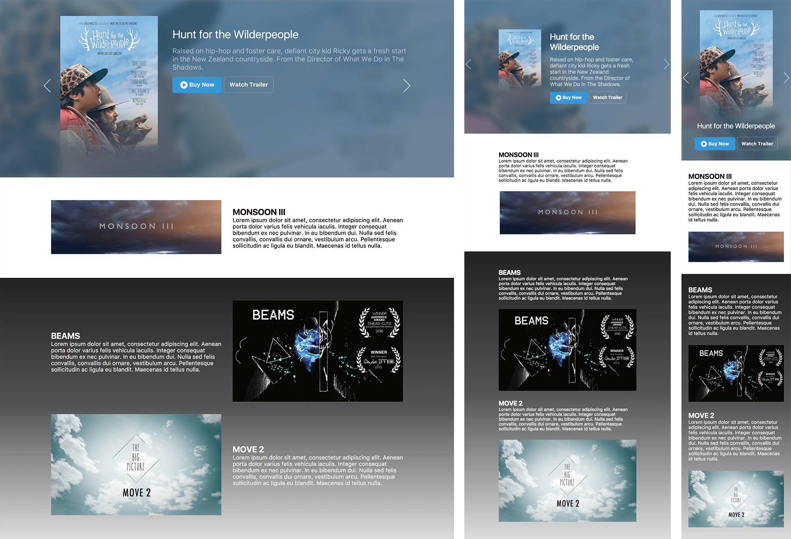

# Vimeo OA Answer

## Problem Statement:

[http://codepen.io/eric-smiling/full/GrxryG/](http://codepen.io/eric-smiling/full/GrxryG/)

## Online Demo:

+ Online demo: [http://wanghong-yang.github.io/vimeoOA/](http://wanghong-yang.github.io/vimeoOA/)
+ Code Repo: [https://github.com/WangHong-yang/wanghong-yang.github.io/tree/master/vimeoOA](https://github.com/WangHong-yang/wanghong-yang.github.io/tree/master/vimeoOA)

## Framewrok:

+ Icon Font: [front-awsome](http://fontawesome.io/)
+ [AngularJS 1](https://angularjs.org/)
+ [Swiper(iDangeros)](http://idangero.us/swiper/#.WJecS7YrKRs) for carousel

## Run the Project:

1. Download repo at [https://github.com/WangHong-yang/wanghong-yang.github.io/tree/master/vimeoOA](https://github.com/WangHong-yang/wanghong-yang.github.io/tree/master/vimeoOA)
2. Open local python HTTP server:  `python -m SimpleHTTPServer 8000`
3. Open `http://localhost:8000` in browser

## Problems Solved in Coding:

+ image and text layout: consider change component order when responsive on phone
  + Use flex-box to assign order
+ swiper.js + Angular, swiper initialize error
  + Create a new directive as attribute to monitor when DOM is fully loaded
+ Img bottom to transparent
  + Use image-mask
+ Blur - image edge will also be blurred
  + Scale(1.03) make image bigger
  + Parent overflow hidden
+ Carousel flickers in webkit(Safari) when using blur & animation
  + transform Z to change into 3D, use GPU to render 
  + Also performance is better

## Other:

+ Responsive (2 media query point for phone, pad, and laptop)
+ IE11+ compatible